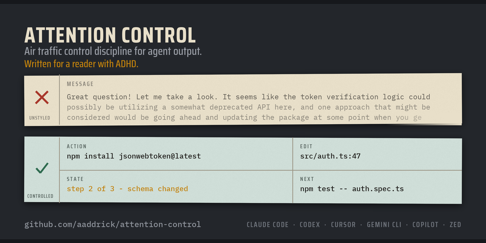

<p align="center">
  
</p>

<p align="center">
  <strong>Attention Control</strong><br>
  <em>航空管制の規律を、AI の出力に。</em><br>
  <em>ADHD の読み手のために書かれています。</em>
</p>

<p align="center">
  <a href="../../LICENSE"></a>
  <a href="../workflows/plugin-load-check.yml"></a>
</p>

<p align="center">
  <a href="https://www.linkedin.com/in/aaddrick/">LinkedIn でつながりましょう！</a>
</p>

<p align="center">
  <a href="../../README.md">English</a> ·
  <a href="README.zh-CN.md">简体中文</a> ·
  <strong>日本語</strong> ·
  <a href="README.ko.md">한국어</a> ·
  <a href="README.vi.md">Tiếng Việt</a> ·
  <a href="README.pt-BR.md">Português (BR)</a>
</p>

## インストール

<details open>
<summary><strong>Claude Code</strong></summary>

出力スタイルの枠を持つエージェントは Claude Code だけです。ターミナルで次の
2 つのコマンドを実行します。

```bash
claude plugin marketplace add aaddrick/attention-control
```

```bash
claude plugin install attention-control@attention-control
```

次に `/config` を実行し、**Output style** から **Attention Control** を選びます。
`/clear` または次のセッションから有効になります。

メニューを使わずに設定するなら、`~/.claude/settings.json` に `outputStyle` を
追加します。これはトップレベルのキーです。`env` や `permissions` の中には
入れません。

```json
{
  "model": "opus",
  "env": { "EXAMPLE_VAR": "1" },
  "outputStyle": "Attention Control"
}
```

`model` と `env` は、すでに持っているキーの例です。それらはそのまま残し、
`outputStyle` の行を横に追加します。

毎セッションではなく 1 セッションだけ使うなら、プラグインが同梱するスキルを
呼び出します。

```
/attention-control:attention-control
```

止めるときは「stop attention control」と伝えます。

</details>

<details>
<summary><strong>Codex</strong></summary>

Codex には出力スタイルの枠がありません。ルールはスキルとして届きます。

```bash
codex plugin marketplace add aaddrick/attention-control --ref main
```

```bash
codex plugin add attention-control@attention-control
```

Codex の中では、`/plugins` がプラグインブラウザを開きます。

新しいスレッドを開始し、スキルを入力します。

```
$attention-control:attention-control
```

Codex はプラグインのスキル名にプラグイン名を前置します。止めるときは
「stop attention control」と伝えます。毎ターン適用するなら、
[INSTALL.md](../../INSTALL.md#the-always-on-snippet) の常時適用スニペットを
`~/.codex/AGENTS.md` に貼り付けます。

</details>

<details>
<summary><strong>Cursor、Gemini CLI、Copilot、Zed、手動インストール</strong></summary>

[INSTALL.md](../../INSTALL.md) を参照してください。いずれも出力スタイルの枠を
持たないため、ルールはスキル、ルールファイル、または `AGENTS.md` のブロックとして
届きます。スキル経路では `/attention-control` と入力し、止めるときは
「stop attention control」と伝えます。

</details>

## 何をするのか

航空管制の定型用語が存在する理由はひとつです。負荷の高い人間は指示を聞き違えます。
航空業界はこれを 2 つの規律で解決しました。統制された語彙が、1 つの語に 1 つの
意味だけを持たせます。固定された文型が、指示を先頭に、背景を末尾に置きます。

このスタイルは同じ 2 つの規律をコーディングエージェントに適用します。エージェントは
実行できるアクションを先に示し、1 語 1 義で各文を書きます。

このスタイルが想定する読み手は 1 種類だけです。ADHD の読み手です。シェイプの
ルールはその読み手から生まれました。[シェイプのルールが生まれた理由](#シェイプのルールが生まれた理由)
を参照してください。

## 何が変わるか

<table>
<tr>
<td width="50%">

### 変更前

> いい質問ですね！確認してみましょう。認証フローにはいくつかの要素が絡んでいる
> ようです。`src/auth.ts` を見ると、トークン検証のロジックが非推奨の API を使って
> いる可能性があります。42〜58 行目あたりの `verifyToken` 関数が、古い
> `jsonwebtoken` のシグネチャに対して実装されているようです。考えられる方法の
> ひとつは、パッケージを更新してその関数をリファクタリングすることでしょう。
> ちなみに、依存関係のバージョン全体もいずれ見直したほうがよいかもしれません。
> お役に立てば幸いです！さらに掘り下げたい点があればお知らせください。

</td>
<td width="50%">

### 変更後

> `npm install jsonwebtoken@latest` を実行します。
>
> `src/auth.ts:47` を変更しました。`verifyToken` はアルゴリズムを明示します。
>
> `jwt.verify(token, secret, { algorithms: ["HS256"] }, callback);`
>
> `npm test -- auth.spec.ts` を実行します。10 秒ほどで終わります。
>
> 以前の呼び出しはアルゴリズムを指定しませんでした。`jsonwebtoken` v9 は、
> `algorithms: ["none"]` を渡さない限り署名なしトークンを拒否します。
>
> 次: テストが失敗したら、最初のエラー行を貼ってください。

</td>
</tr>
</table>

## 2 つのレイヤー

**シェイプ**は、何をどの順で言うかを決めます。11 のルール。

1. 次のアクションから始める。
2. 自分の担当分は自分でやる。
3. 複数ステップの作業に番号を振る。
4. 具体的な次の一手で終える。
5. 脱線を抑える。
6. 毎ターン状態を言い直す。
7. 所要時間は具体的な単位で示す。
8. 今、何が動くようになったかを示す。
9. エラーは淡々と述べる。
10. リストは 5 項目まで。
11. 前置きなし、要約なし、締めの挨拶なし。

**言語**は、各文の書き方を決めます。

- 1 語 1 義。1 つの動作に 1 つの動詞。類義語を使い回さない。
- 標準動詞: check、make sure、start、stop、use、show、find、change、remove、need。
- 能動態を使い、動作主を明示する。
- 単純時制のみ。完了時制も助動詞の積み重ねも使わない。
- 指示は 1 文 20 語まで、説明は 25 語まで。名詞の連結は 3 語まで。

全文は [`output-styles/attention-control.md`](../../output-styles/attention-control.md) にあります。

## シェイプのルールが生まれた理由

ADHD の読み方に関する 5 つの事実が、11 のシェイプルールすべてを生みます。下の表は、
各事実がどのルールを生むかを示します。

| 事実 | エージェントの動き |
|---|---|
| **作業記憶が小さい。** 画面にないものは存在しないのと同じです。 | 「X を覚えておいてください」とは書きません。毎ターン状態を言い直します。「5 ステップ中 3 ステップ完了: スキーマを変更しました。次: `scripts/backfill.py` を実行します。」（ルール 6、10） |
| **答えを知ることと、答えを実行することは別。** 作業はその隙間で止まります。 | 作業を読み手に投げ返さず、自分の担当分は自分で終わらせます。ラベルではなくコマンドを渡します。「不足しているヘッダーを追加する」はラベルです。`Authorization: Bearer ${token}` が修正です。（ルール 1、2、3） |
| **着手が最も難しい。** | 最初の行は小さく、明確で、今すぐ実行できます。最後の行は 2 分以内に終わるアクションを 1 つ示します。「ファイルを開く」でも構いません。（ルール 1、4） |
| **時間の見積もりが同じに感じられる。** 「少し手間がかかる」と「数時間」は同じに響きます。 | 「テストがカバーしていれば 15 分ほど、していなければ半日」と書きます。「それなりの作業」とは書きません。（ルール 7） |
| **ドーパミンが乏しい。** 埋もれた成果は届きません。 | 変更のあとで結果を具体的に示します。「マジックリンクでログインできます。`npm run dev` を実行して `/login` を開いてください。」（ルール 8） |

さらに 2 つのルールが注意そのものを守ります。ルール 5 は脱線を抑え、開いた作業を
1 本に保ちます。ルール 11 は前置きと締めの挨拶を削り、答えを 1 行目から始めます。

だからこのスタイルは「短くする」ことではありません。コマンド、数値、条件を削る
簡潔さは、読み手に往復を 1 回強います。その往復が作業の流れを切ります。ルール 9 も
同じ理屈です。エラーには場所、原因、修正を書き、前に「おっと」は付けません。
動揺は情報ではなく、同じ注意を情報と奪い合います。

ADHD の診断は必要ありません。疲れた読み手、スマートフォンで読む人、タブを 40 個
開いている人も、読み方は同じです。

## 手を加えないもの

対象は 4 つ、それぞれに 1 つのルールがあります。コード、コマンド、ファイルパス、
識別子、エラーメッセージは 1 文字も変えずにそのまま再現します。引用したテキストも
そのまま再現します。コード内のコメントとコミットメッセージは、そのリポジトリの
書き方に合わせます。このスタイルに従うのは、エージェント自身が書く文章だけです。

これは指示であって、強制力ではありません。出力スタイルはシステムプロンプトの
文章なので、モデルの外側に強制する仕組みはありません。この境界は強い既定値として
扱い、重要な場面では出力を確認してください。

正確さは簡潔さに優先します。文を短くするために事実、数値、条件、適用範囲を削る
ことはありません。実際の不確実性を表す表現はそのまま残します。

## 評価

評価ハーネスは、スタイルを適用しないベースラインと回答の品質を比較します。長さは
測りません。

```bash
python3 scripts/run_evals.py validate
```

```bash
python3 scripts/run_evals.py plan --trials 3
```

24 ケース、6 つの採点軸、そして正確性や安全性の後退を止めるリリースゲート。

弱点はジャッジなので、ハーネスはそこを狙います。`blind` は条件を隠し、提示位置を
均等にします。ジャッジは各グループを 2 回採点し、2 回目は順序を逆にして、2 回の
不一致率を報告します。ランナーは空のディレクトリで動き、あなたの設定を一切
読みません。設計の意図と実測値は [evals/README.md](../../evals/README.md) にあります。

## 自分で調整する

フォークして `output-styles/attention-control.md` を編集し、エージェントごとの
コピーを再生成します。

```bash
python3 scripts/sync_style.py
```

自分のコピーに入れ替えます。1 コマンドずつ実行します。

```bash
claude plugin uninstall attention-control
```

```bash
claude plugin marketplace remove attention-control
```

```bash
claude plugin marketplace add <your-username>/attention-control
```

```bash
claude plugin install attention-control@attention-control
```

## クレジット

このスタイルは既存の 2 つの作品を組み合わせたものです。どちらの作者も本プロジェクトに
関与していません。

**シェイプ層:** Ayoub G. の [`i-have-adhd`](https://github.com/ayghri/i-have-adhd)（MIT）。
評価ハーネスも同じプロジェクトに由来します。

**言語層:** [L1nefeed](https://github.com/L1nefeed) の
[`asd-ste100` 出力スタイル](https://gist.github.com/L1nefeed/4164ecaaf77879e76dca3c06f142f1c2)。
これ自体が [ASD-STE100](https://www.asd-ste100.org/) Simplified Technical English 第 9 版を
凝縮したものです。

本プロジェクトは ASD 規格の文章を一切複製しておらず、認証、承認、提携のいずれも
受けていません。詳細は [NOTICE.md](../../NOTICE.md) にあります。

## ライセンス

MIT。[LICENSE](../../LICENSE) を参照してください。
